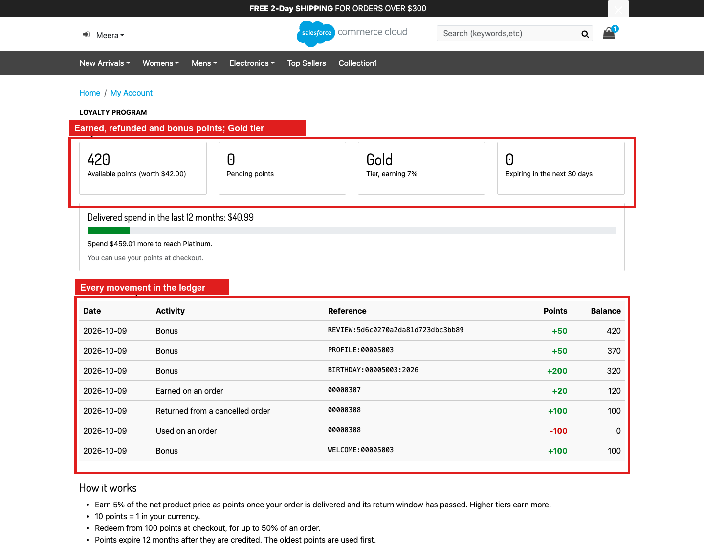
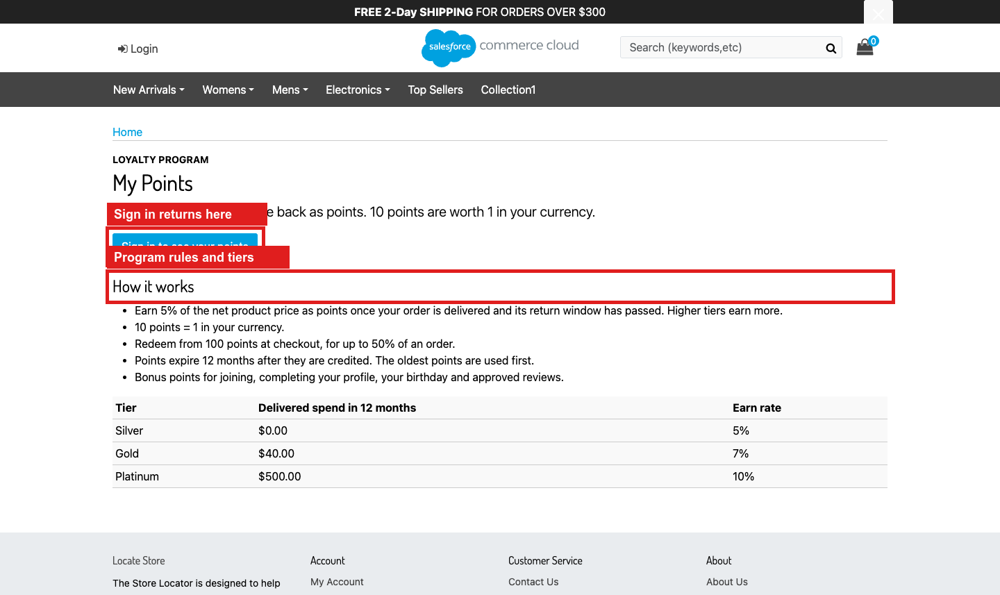
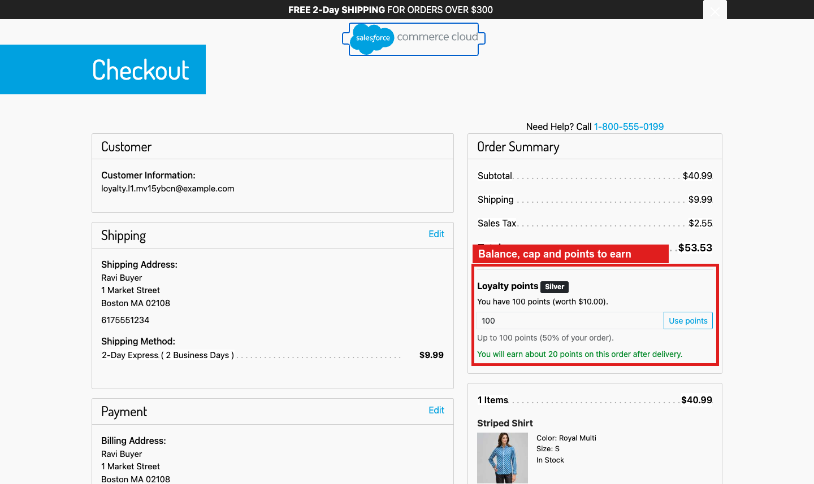
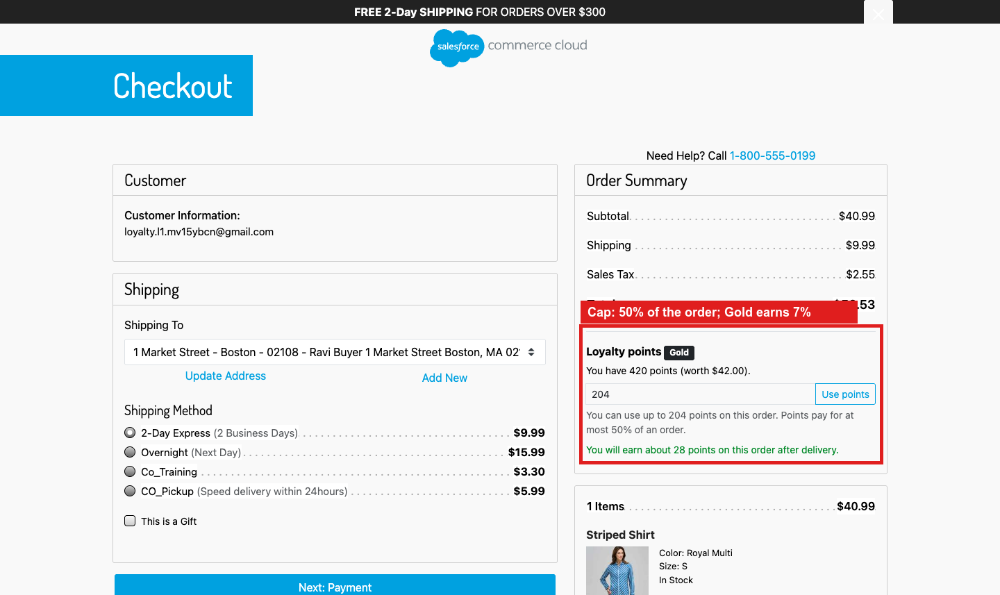

<div align="center">

# SFCC Loyalty Program

### Points on every delivered order. Redeem at checkout. Climb the tiers.

Earn 5% of the net product price back as points (10 points = 1), redeem from 100 points for up to
50% of an order, Silver/Gold/Platinum tiers, welcome, birthday, profile and review bonuses, and
12-month first-in-first-out expiry with reminders.

[](https://github.com/Vedesh-reddy/sfcc-loyalty-program/actions/workflows/ci.yml)


[Get started](docs/INSTALLATION.md) · [Merchant guide](docs/MERCHANT-GUIDE.md) · [Code reference](docs/CODE-REFERENCE.md) · [Architecture](docs/ARCHITECTURE.md) · [Phase PRs](docs/DEVELOPMENT-PHASES.md)

</div>



> Screenshots were captured on the author's sandbox (`zyeu-002`, site `RefArch_Practice`) on October 9, 2026.
> The orders are real SFCC orders and every number comes from the live ledger. Red boxes mark what each feature adds.

## What it does

| For shoppers | For merchants | For developers |
| --- | --- | --- |
| Earn points on every delivered order | Every rule is a site preference in one **Loyalty Program** group | One `plugin_loyalty` overlay; no base file edited |
| See balance, value, pending points and tier on **My Points** | Two jobs: order processing every 30 minutes, daily upkeep | Immutable ledger keyed `customerNo:sequence` serializes balance changes |
| Use points at checkout as an order discount | Silver/Gold/Platinum thresholds and earn rates | Idempotent credits: the lot key is the credit source |
| Know before ordering how many points they will earn | Bonuses for welcome, birthday, profile and reviews | Reservation at order creation, refund on any failure |
| Get points back when an order is cancelled | See why an order's points are still pending (`reviewReason`) | 18 unit tests asserting balance = sum of open lots |
| Get a reminder before points expire | Expiry and reminder windows | CSRF on every post; categorized logging (`loyalty-program`) |

## Start in five steps

```sh
git clone https://github.com/Vedesh-reddy/sfcc-loyalty-program.git
cd sfcc-loyalty-program
npm ci
npm run validate
npm run package:metadata
```

1. **Build:** `npm run validate` runs the linters, 18 unit tests and the asset build.
2. **Deploy:** upload `cartridges/plugin_loyalty`, including the generated `cartridge/static`, to your code version.
3. **Activate:** put `plugin_loyalty` first on the storefront cartridge path.
4. **Import:** rename `metadata/loyalty-program/sites/RefArch` and the job `site-id` to your site, rebuild the ZIP and import `dist/loyalty-program-metadata.zip`.
5. **Configure:** add the **My Points** footer link and schedule the two jobs.

```text
plugin_loyalty:app_storefront_base
```

The [installation guide](docs/INSTALLATION.md) covers each step.

## Features

| # | Feature | Shopper entry point | Data | Job |
| --- | --- | --- | --- | --- |
| 1 | [My Points page](#1-my-points-page) | Footer link, `Loyalty-Show` | `LoyaltyAccount`, `LoyaltyLedger` | — |
| 2 | [Earning points](#2-earning-points) | Checkout, order confirmation | `LoyaltyOrder` | `Loyalty-ProcessOrders` |
| 3 | [Redeeming points](#3-redeeming-points) | Checkout panel | Basket and order attributes, `LoyaltyLot` | — |
| 4 | [Cancellations and refunds](#4-cancellations-and-refunds) | — | `LoyaltyOrder`, `LoyaltyLedger` | `Loyalty-ProcessOrders` |
| 5 | [Tiers](#5-tiers) | My Points, checkout | `LoyaltyAccount` | Both jobs |
| 6 | [Bonus points](#6-bonus-points) | — | `LoyaltyLot` | `Loyalty-Maintain` |
| 7 | [Expiry and reminders](#7-expiry-and-reminders) | Email | `LoyaltyLot` | `Loyalty-Maintain` |

---

### 1. My Points page

**What it does.** A footer link opens **My Points**.

1. The footer link:

   

2. Signed out, the page explains the program and tiers. Sign-in returns here (login slot `rurl=5`).

   

3. The first visit opens the account with a 100-point welcome bonus. The page shows balance and value, pending points, tier, points expiring soon, progress to the next tier, and the ledger.

   

---

### 2. Earning points

**What it does.** A placed order records *pending* points. They become *available* once the order is paid, delivered (the order or every shipment is Shipped), and past `LoyaltyReturnWindowDays` (7; the screenshots used 0).

1. Checkout shows what the order will earn. Guests see the points they would earn by signing in.

   

2. The order confirmation repeats it. This Gold member earns 7% of $40.99, which is 28 points.

   

**Rules**

- Points = net product price × tier rate × 10, rounded down. The base is after every discount, including points, and excludes shipping and tax. So $100 at 5% gives 50 points, worth $5.
- The rate is fixed by the tier when the order is placed.
- Returned items (non-cancelled return cases) are left out when points are released.
- Guests earn nothing.

---

### 3. Redeeming points

**What it does.** A panel under the checkout totals turns points into an order discount (10 points = 1).

1. The panel shows the balance, how many points this order can use, and the points to earn.

   

2. Applying 100 points adds a −$10.00 **Order Discount**. The order earns on the reduced price (15 points instead of 20).

   

3. Below the 100-point minimum, the panel says how many more are needed.

   

4. Points can pay at most `LoyaltyMaxRedeemPercent` (50%) of an order: with 420 points on a $40.99 order, at most 204.

   

**How it works**

- **Applying points:** `Loyalty-Apply` stores the requested points on the basket. The `basketCalculationHelpers` wrapper turns them into a custom order price adjustment (`loyalty-points`), always within the minimum, the balance and the cap.
- **Reserving points:** the `checkoutHelpers.createOrder` wrapper takes the points from the balance when the order is created, consuming the soonest-expiring lots first. If the balance was spent elsewhere in the meantime, the order is failed instead of discounted, and `CheckoutServices-PlaceOrder` warns the shopper first.
- **Failed payment:** if payment authorization or placement fails, the points are returned at once. The order job catches any other failed order.

---

### 4. Cancellations and refunds

Order 00000308 used 100 points and was then cancelled in Business Manager. The order job:
- returned the 100 points to the lots they came from, keeping their original expiry;
- dropped the order's pending points.

The ledger shows every movement with the balance after it:


---

### 5. Tiers

| Tier | Delivered spend in 12 months | Earn rate |
| --- | --- | --- |
| Silver | 0 | 5% |
| Gold | `LoyaltyGoldThreshold` (1,000; the screenshots used 40) | 7% |
| Platinum | `LoyaltyPlatinumThreshold` (2,500; the screenshots used 500) | 10% |

The tier is re-evaluated when an order's points are released. The daily job also re-evaluates it, so customers drop a tier when old orders leave the 12-month window. Above, delivering order 00000307 ($40.99) moved the member to Gold.

---

### 6. Bonus points

| Bonus | Default | When |
| --- | --- | --- |
| Welcome | 100 | The loyalty account is opened |
| Birthday | 200 | On the profile birthday, once a year (daily job) |
| Completed profile | 50 | Name, phone, birthday and an address are present (daily job) |
| Approved review | 50 | A `plugin_productreviews` review is approved (daily job; skipped when that cartridge is not installed) |

Each bonus is a lot whose key is the bonus itself (`BIRTHDAY:<customer>:<year>`, `REVIEW:<review>`), so it can never be credited twice.

---

### 7. Expiry and reminders

- Points expire `LoyaltyExpiryMonths` (12) after they are credited. Redemption uses the oldest points first.
- The daily job expires lots and sends one reminder per customer `LoyaltyExpiryReminderDays` (30) before points expire.

This path is covered by unit tests, not screenshots.

---

## Data integrity

- **Ledger:** every balance change writes an immutable `LoyaltyLedger` entry keyed `customerNo:sequence`. Two concurrent writers for one customer collide on that key and one rolls back, so balances are never lost or double-spent.
- **Invariant:** the account balance equals the sum of open lots. The unit tests assert it after every scenario.
- **Idempotent credits:** each credit's lot key is its source (`ORDER:<no>`, a bonus key), so job retries never double-credit.

## Documentation

| Guide | Contents |
| --- | --- |
| [Installation](docs/INSTALLATION.md) | Deploy, cartridge path, metadata, footer link, jobs |
| [Merchant guide](docs/MERCHANT-GUIDE.md) | Preferences, tiers, bonuses, jobs, custom objects |
| [Architecture](docs/ARCHITECTURE.md) | Request flows, ledger and lots, concurrency, state machine |
| [Code reference](docs/CODE-REFERENCE.md) | Every controller route, script module and job step |
| [Testing](docs/TESTING.md) | Automated checks and the sandbox checks behind the screenshots |
| [Troubleshooting](docs/TROUBLESHOOTING.md) | Symptoms, causes and fixes found on a real sandbox |
| [Development phases](docs/DEVELOPMENT-PHASES.md) | The five review PRs |

See [NOTICE.md](NOTICE.md) for attribution and terms.
